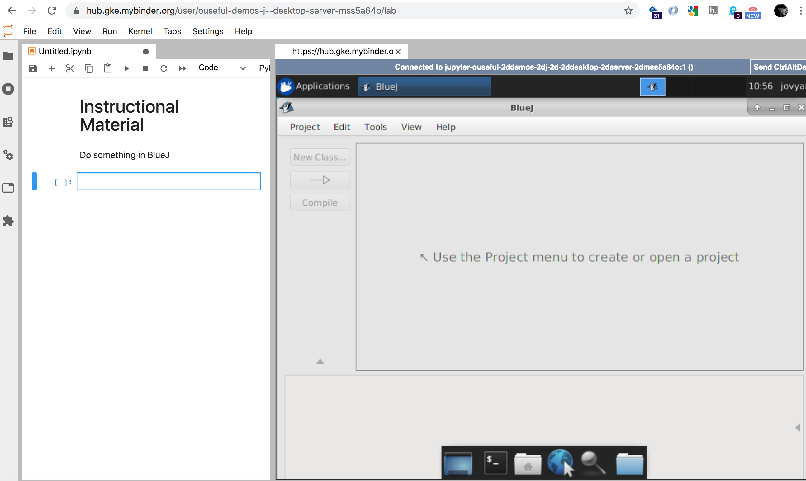

# Jupyter Desktop Server + BlueJ

Launch into desktop: 

Launch into JupyterLab: 

Launch into notebook: 

Run XFCE (or other desktop environments) on a JupyterHub; demo includes running BlueJ Java desktop IDE.

The main contribution from this repo is the demo Dockerfile.

## To Do

- fix desktop icon
- add [IJava](https://github.com/SpencerPark/IJava) kernel or other Java kernel to allow Java execution in notebook; example [here](https://github.com/ntartania/INF1563_Notebooks/blob/master/Dockerfile) with some teaching notebooks maybe along the way in that repo? [DONE]
